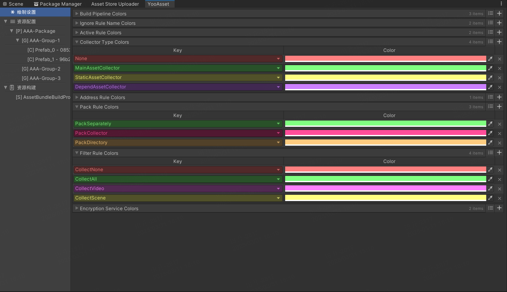
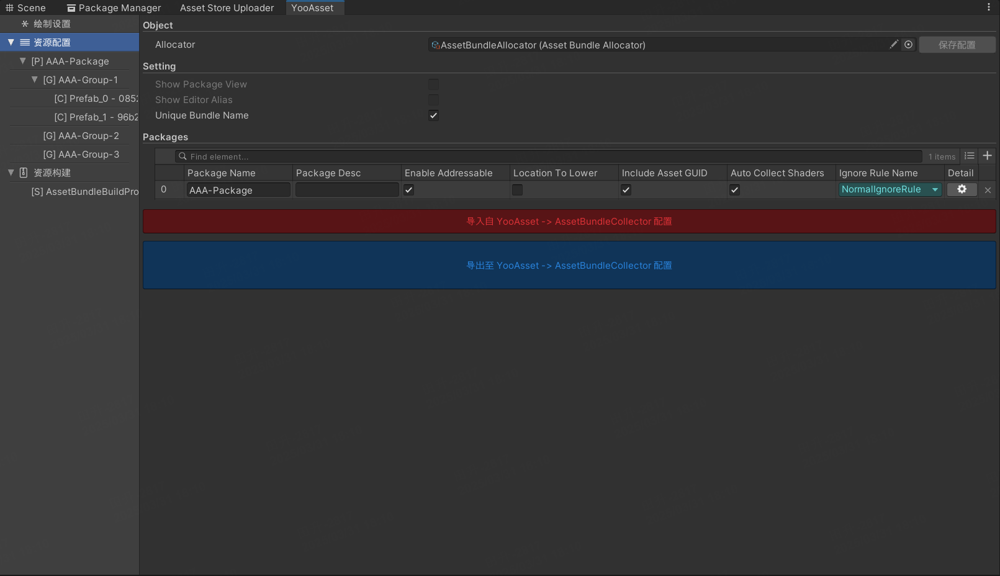
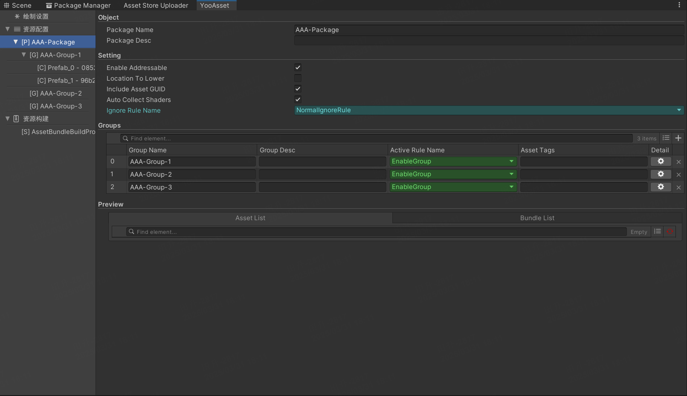
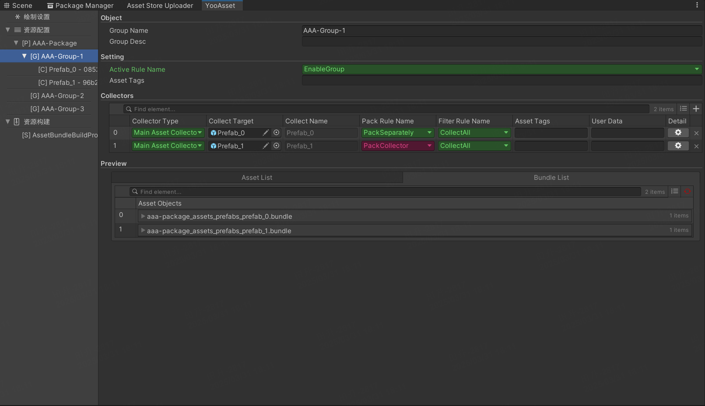
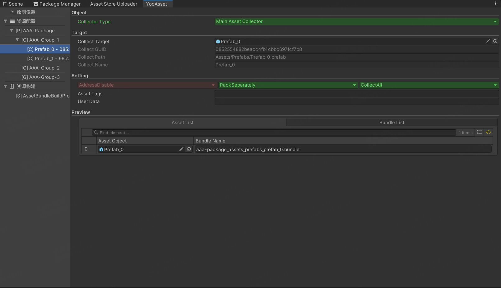
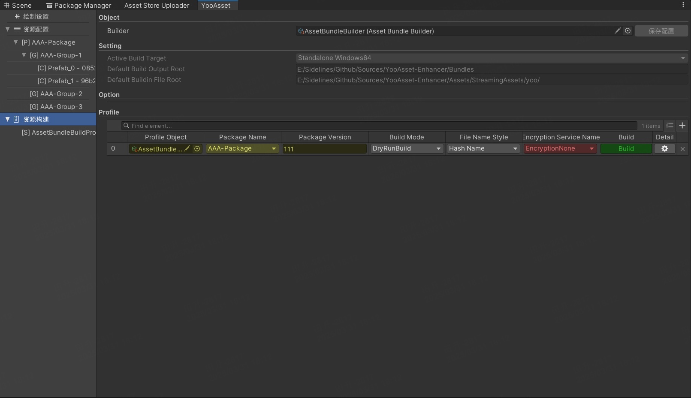
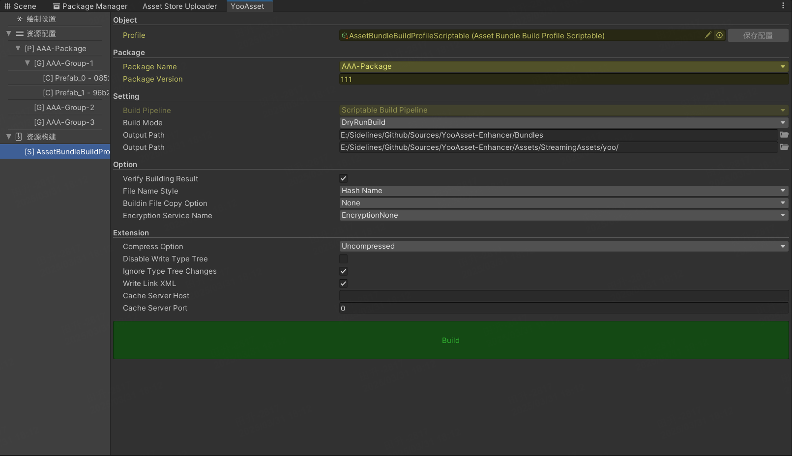

# YooAsset-Enhancer（YooAsset 的增强器）

## 注意事项
1. 使用了 [Odin](https://assetstore.unity.com/packages/tools/utilities/odin-inspector-and-serializer-89041) 插件，请自行购买添加；
2. 基于 [YooAsset](https://www.yooasset.com/) 的 [2.1.2](https://github.com/tuyoogame/YooAsset/releases/tag/2.1.2) 版本研发，未测试其他版本兼容性；

## 如何使用
1. 使用的话可以直接拷贝此部分代码 [com.dustman.yooasset.enhancer](Packages/com.dustman.yooasset.enhancer) 到 `Packages` 目录内；
2. 导入后如果没报错的话，在 Unity 菜单栏选择 `Yoo Asset/Extensions/Main Window`；

## 功能特性
1. 使用 Odin 绘制 `资源配置` 和 `资源构建` 窗口，美化 UI；
2. 使用 MenuTree 的形式绘制带来更直观简洁的收集器配置；
2. 支持对 Package、Group、Collector 进行打包结果 Preview，便于快速了解打包结果；
3. 以 Table 的形式展示 Package、Group、Collector、Preview，更加简洁明了，便于快速修改配置；
4. 解决 YooAsset 构建依赖于 EditorPrefs 数据的问题，使打包配置可以保存为序列化文件，便于版本管理；

## 功能介绍
### 绘制设置
可以调整各种枚举类型的颜色：

### 资源配置
修改资源包裹列表，修改全局设置：

修改资源分组列表、修改资源包裹设置、包裹资源打包预览：

修改资源收集器列表、修改资源分组设置、分组资源打包预览：

修改资源收集器设置、收集资源打包预览：

### 资源构建
修改打包列表、预览打包信息：

修改打包设置：
